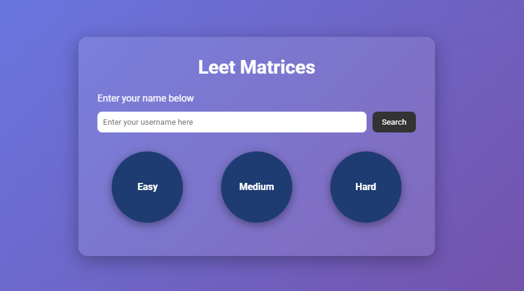
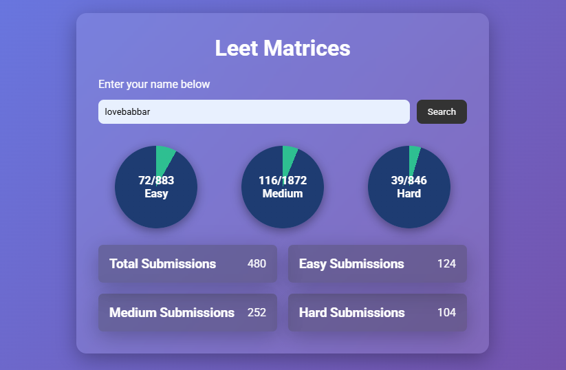

# LeetMatrices Web App 🔢

LeetMatrices is a web application that allows users to **track their LeetCode problem-solving progress** in a clean, visual, and interactive way.

## 🚀 Features

- 🔎 Search by LeetCode username
- 📊 Visualize progress in **Easy, Medium, and Hard** categories
- 📈 Total submissions displayed in stats cards
- ✅ Simple, fast, and responsive interface
- 🎨 Built using **HTML**, **CSS**, and **JavaScript**
- ⚡ Fetches live data via LeetCode GraphQL API (via proxy for CORS handling)

---

## 🖥️ Screenshots

## 📸 Screenshot





---

## 📂 Technologies Used

- **HTML5**
- **CSS3**
- **JavaScript (Vanilla)**
- **LeetCode GraphQL API**
- CORS Anywhere Proxy (for API calls)

---

## ⚙️ How It Works

1. Enter your **LeetCode username**.
2. Click on the **Search** button.
3. The app fetches your stats from LeetCode and shows:
   - ✅ Solved Questions (Easy/Medium/Hard)
   - 📊 Submission Stats
4. Data is shown in a clean and responsive dashboard.

---

## 📥 Setup Locally

```bash
# Clone the repository
git clone https://github.com/YourUsername/LeetMatricesWebApp.git

# Navigate into the project folder
cd LeetMatricesWebApp

# Open index.html in your browser
#before you run html run the under given link tommake a temporary proxy server than onlt this code will work
 Request Temporary CORS Proxy Access:
Go to:
https://cors-anywhere.herokuapp.com/corsdemo

→ Click: Request temporary access
Then your app will start working (for a short time).
